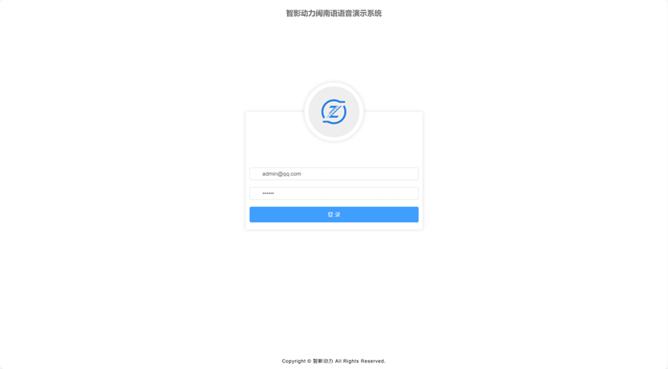
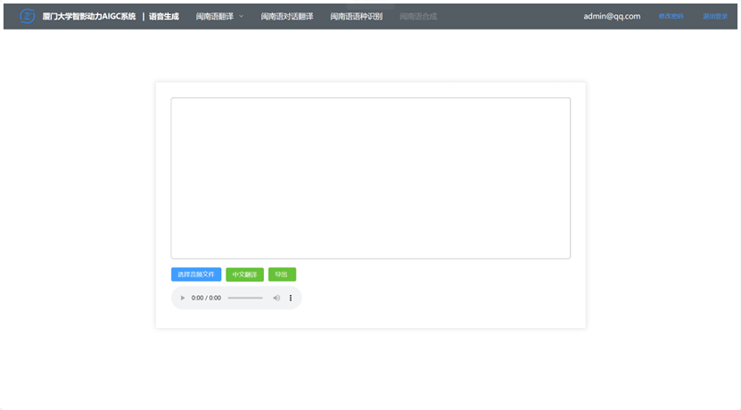
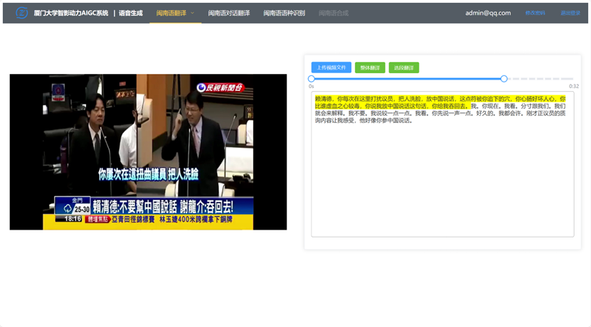
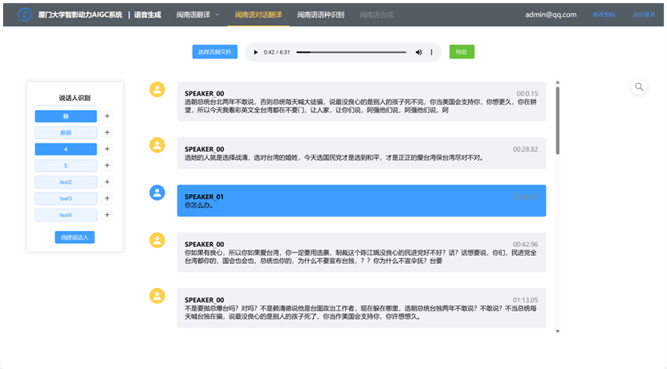

# translation-system
## 核心技术
响应式数据绑定、ffmpeg的封装
## 登录页
使用浏览器会话记录

## 音频翻译界面
提供导出功能，播放到对应语句高亮提示

## 视频翻译界面
用户可选择整段翻译和选段翻译

## 对话翻译界面
用户可选择数据库中已有的说话人（领导或重要人物）或者新建说话人为其导入语音进行训练。同时，该界面在高亮提示正在播放片段的基础上额外增加了搜索功能，点击对话框可跳转到相应播放位置

## 闽南语语种识别界面
支持用户一次性上传多个文件，识别区分闽南语素材和其他语种

